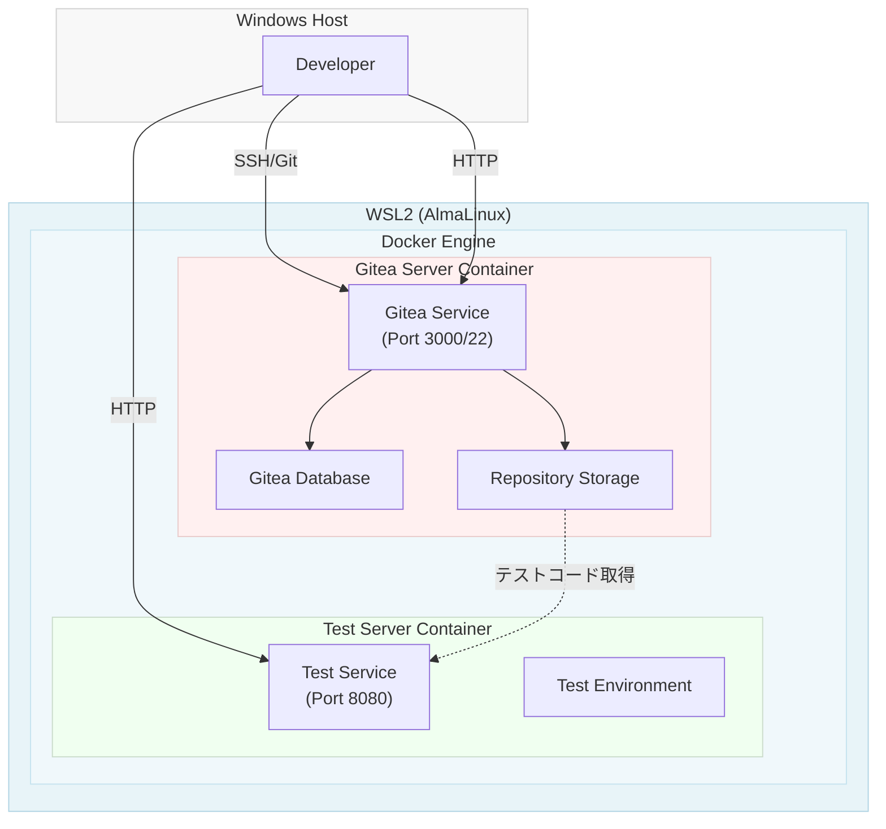

# AlmaLinux on WSL2 - システムアーキテクチャ

## 概要
WSL2上に構築されたAlmaLinux環境でDockerコンテナを実行します。

## アーキテクチャ図



## コンポーネント説明

### Gitea Server Container
- **役割**: Git リポジトリホスティングとバージョン管理
- **イメージ**: gitea/gitea:latest
- **ポート**: 3000 (Web UI), 22 (SSH)
- **ストレージ**: Gitea データ、リポジトリの永続化
- **データベース**: PostgreSQL

### Test Server Container
- **役割**: テスト実行環境
- **ポート**: 8080 (テストサーバー)
- **環境**: テスト実行が可能な基本環境

## 通信フロー
1. 開発者 → Gitea: ソースコードのプッシュ/プル
2. Gitea → Test Server: テスト対象のコードを提供
3. Test Server: テスト実行

## 環境構築手順

### 前提条件
- WSL2 (AlmaLinux) がインストール済み
- sudo 権限がある

### 0. systemd の有効化

#### 0-1. /etc/wsl.conf の編集

```bash
sudo vi /etc/wsl.conf
```

以下の内容を追加または編集：

```ini
[boot]
systemd=true
```

#### 0-2. WSL2 の再起動

Windows PowerShell (管理者権限) で実行：

```powershell
wsl --shutdown
```

その後、再度 WSL2 を起動します。

#### 0-3. systemd の確認

```bash
systemctl is-system-running
```

`running` と表示されれば成功です。

### 1. Docker のインストール

#### 1-1. リポジトリの設定

```bash
sudo dnf install -y dnf-plugins-core
sudo dnf config-manager --add-repo https://download.docker.com/linux/rhel/docker-ce.repo
```

#### 1-2. Docker CE のインストール

```bash
sudo dnf install -y docker-ce docker-ce-cli containerd.io docker-buildx-plugin docker-compose-plugin
```

#### 1-3. Docker サービスの起動

```bash
sudo systemctl start docker
sudo systemctl enable docker
```

#### 1-4. 現在のユーザーを docker グループに追加

```bash
sudo usermod -aG docker $USER
newgrp docker
```

#### 1-5. インストール確認

```bash
docker --version
docker run hello-world
```

#### 1-6. Docker CLI プラグインパスの設定

```bash
echo 'export PATH="/usr/libexec/docker/cli-plugins:$PATH"' >> ~/.bashrc
source ~/.bashrc
```

### 2. ディレクトリ構成の準備

```bash
mkdir -p ~/docker-services/gitea/data
mkdir -p ~/docker-services/postgres/data
mkdir -p ~/docker-services/test-server/data
```

### 3. docker-compose.yml の作成

```bash
cat > ~/docker-services/docker-compose.yml << 'EOF'
version: '3.8'

services:
  postgres:
    image: postgres:15-alpine
    container_name: gitea-postgres
    environment:
      POSTGRES_USER: gitea
      POSTGRES_PASSWORD: gitea_password
      POSTGRES_DB: gitea
    volumes:
      - ./postgres/data:/var/lib/postgresql/data
    restart: always
    healthcheck:
      test: ["CMD-SHELL", "pg_isready -U gitea"]
      interval: 10s
      timeout: 5s
      retries: 5

  gitea:
    image: gitea/gitea:latest
    container_name: gitea-server
    environment:
      - ROOT_URL=http://localhost:3000
      - SSH_DOMAIN=localhost
      - SSH_PORT=22
      - SSH_LISTEN_PORT=22
      - GITEA__database__DB_TYPE=postgres
      - GITEA__database__HOST=postgres:5432
      - GITEA__database__NAME=gitea
      - GITEA__database__USER=gitea
      - GITEA__database__PASSWD=gitea_password
    ports:
      - "3000:3000"
      - "2222:22"
    volumes:
      - ./gitea/data:/data
      - /etc/timezone:/etc/timezone:ro
      - /etc/localtime:/etc/localtime:ro
    restart: always
    depends_on:
      postgres:
        condition: service_healthy

  test-server:
    image: alpine:latest
    container_name: test-server
    command: sleep infinity
    ports:
      - "8080:8080"
    volumes:
      - ./test-server/data:/workspace
    restart: always
EOF
```

### 4. コンテナの起動

```bash
cd ~/docker-services
docker-compose up -d
```

### 5. Gitea の初期設定

ブラウザで `http://localhost:3000` にアクセスし、初期セットアップウィザードで以下を設定：
- **データベース**: PostgreSQL
- **ホスト**: postgres:5432
- **ユーザー**: gitea
- **パスワード**: gitea_password
- **データベース名**: gitea
- **サイト名**: AlmaLinux Gitea
- **リポジトリルートパス**: `/data/gitea-repositories`
- **管理者ユーザー**: 作成

### 6. SSH キーの設定（オプション）

```bash
ssh-keygen -t ed25519 -f ~/.ssh/gitea_key -N ""
# 公開鍵を Gitea の Settings > SSH Keys で登録
```

### 7. コンテナの状態確認

```bash
docker-compose ps
docker-compose logs gitea
docker-compose logs postgres
docker-compose logs test-server
```

### 8. コンテナの停止

```bash
docker-compose down
```

## トラブルシューティング

| 問題 | 解決方法 |
|------|--------|
| systemd が起動しない | WSL バージョンを最新に更新：`wsl --update` |
| ポート競合 | `docker ps` で確認し、使用済みポートを避ける |
| データ永続化失敗 | ボリュームマウントパスの権限を確認 |
| SSH 接続失敗 | ポートマッピング設定を確認（デフォルト: 2222→22） |
| Docker コマンド実行時の権限エラー | `newgrp docker` を実行してグループを切り替える |

### トラブルシューティング - systemd 起動失敗時

#### 確認コマンド

```bash
# systemd の状態確認
systemctl is-system-running

# PID 1 プロセスの確認
ps aux | grep -E "^root\s+1"

# ログの確認
sudo journalctl -u docker -n 20
```
